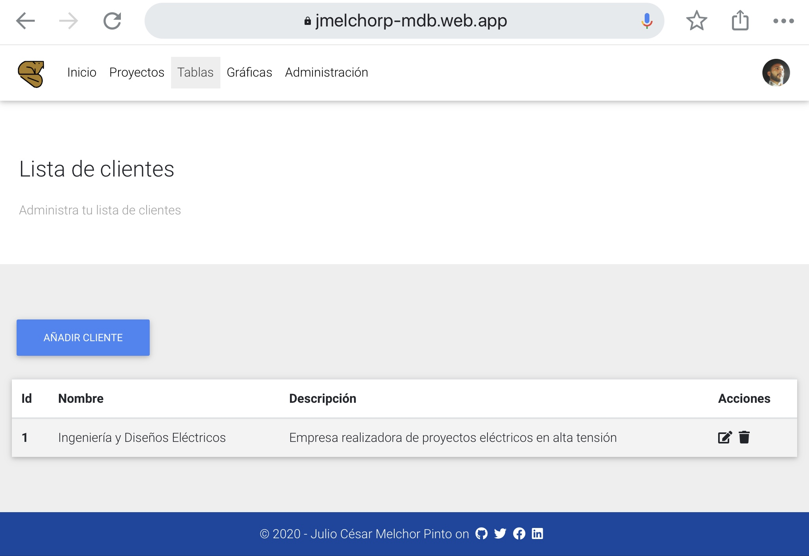
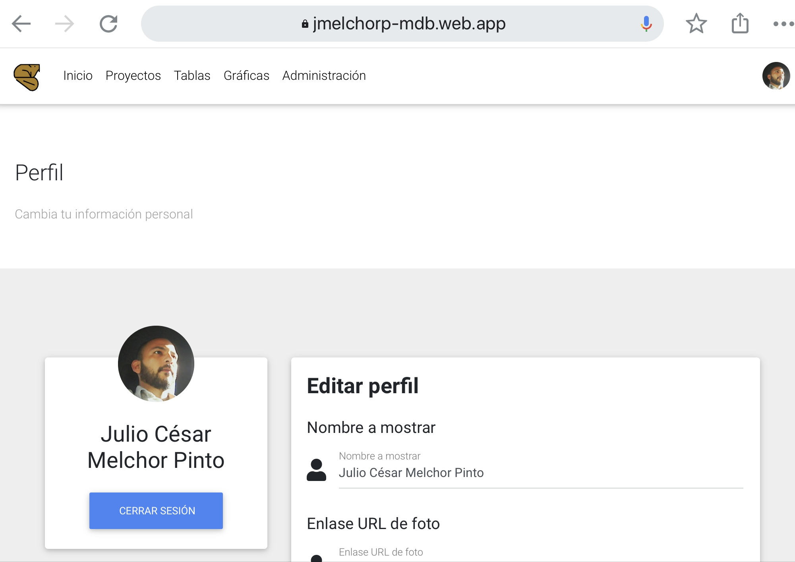
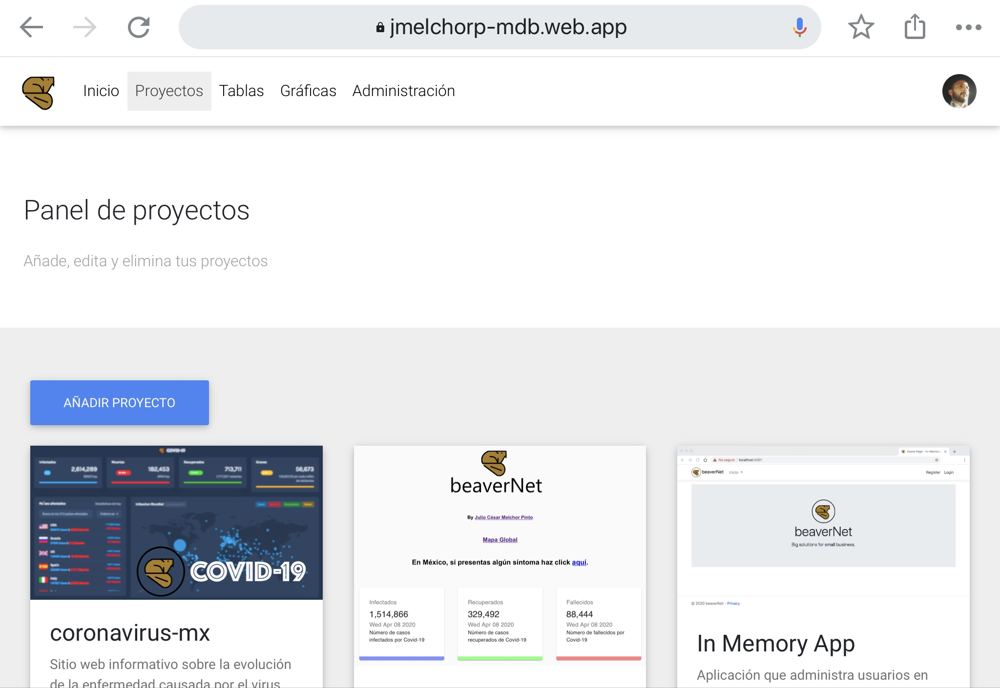
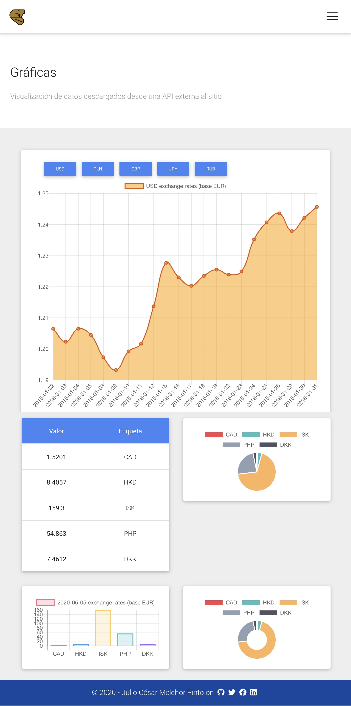

# portfolioMaker
Web application in Angular 8 for exposing a personal work portfolio.

This project was made using MDB Boilerplate as starting template.
________

The goal of **portfolioMaker** is to serve as an opensource platform for manage a personal work porfolio of authenticated users. You can register by provading basic information and login with social providers.

# Live Preview:
## https://jmelchorp-mdb.web.app/

# Technologies used

* Angular 8
* Bootstrap 4
* MDBootstrap Angular
* NgRx
* Firebase 
* i18n translation ( )

# Most important features

* NgRx state management
* Real time updates with Firebase real time database
* Admin panel - manage user content
* Responsive design

# Screenshots

