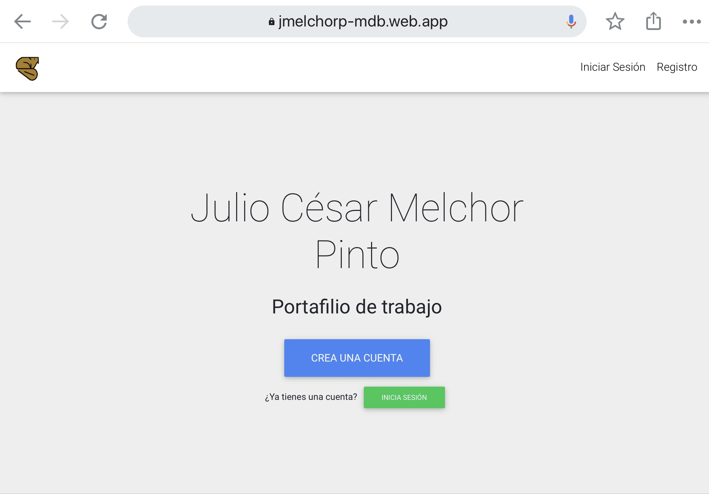

# portfolioMaker
Web application in Angular 9 for exposing a personal work portfolio.

This project was made using MDB Boilerplate as starting template.

________

# Live Preview:
## https://jmelchorp-mdb.web.app/

# Technologies used

* Angular 7
* Bootstrap 4
* MDBootstrap Angular
* NgRx
* Firebase

# Most important features

* NgRx state management
* Real time updates with Firebase real time database
* Admin panel - manage user content
* Responsive design
